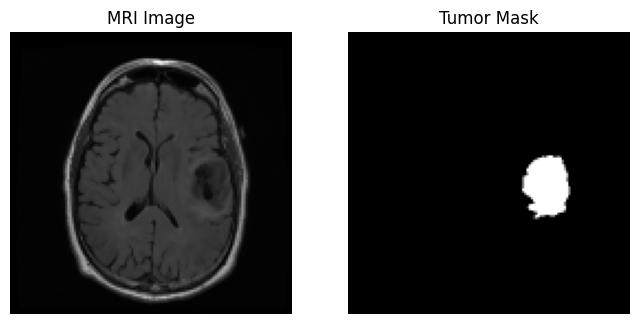
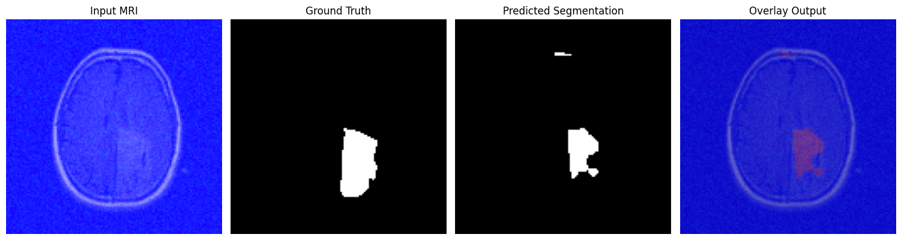
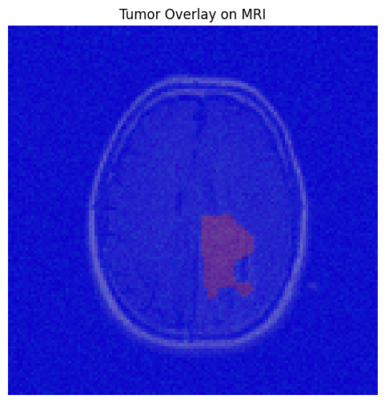
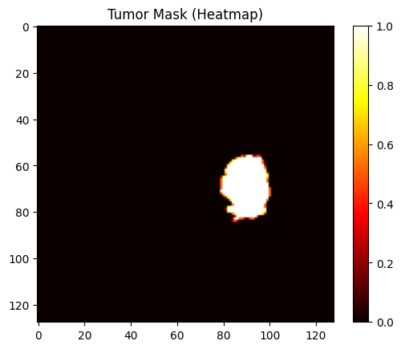
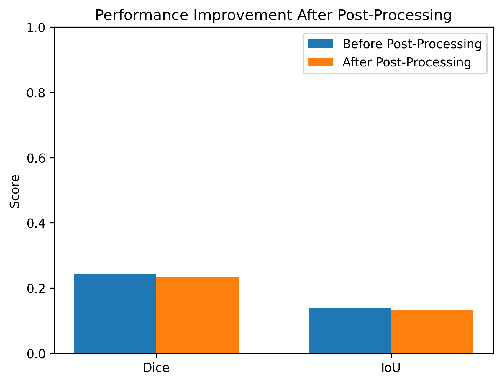
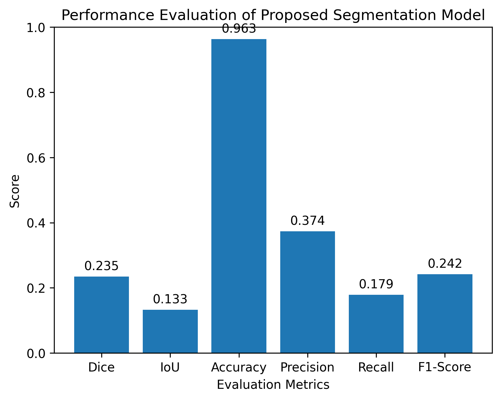
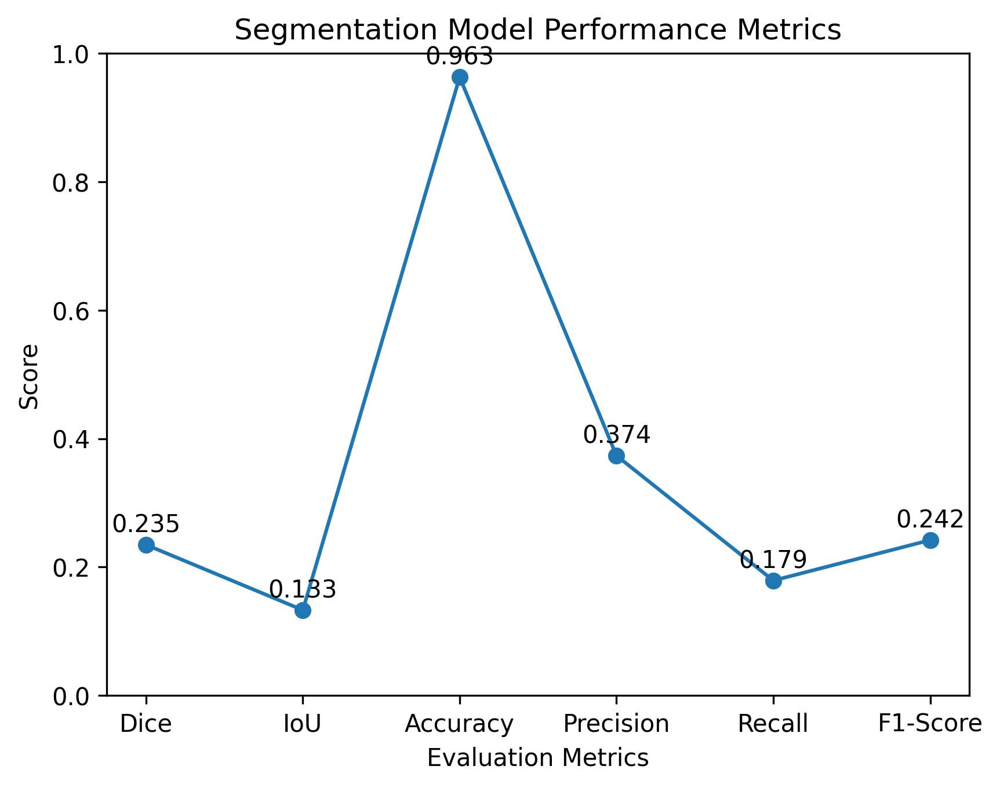

# 🧠 Brain Tumor MRI Segmentation using U-Net + GLCM Texture Features

An end-to-end deep learning pipeline that segments brain tumors from MRI scans. The model
combines a lightweight **U-Net** with **GLCM (Gray-Level Co-occurrence Matrix)** texture
features and a simulated GAN-style augmentation channel, followed by morphological
post-processing and an automated clinical-style summary report.



---

## Table of Contents

- [Overview](#overview)
- [Key Features](#key-features)
- [Pipeline Architecture](#pipeline-architecture)
- [Dataset](#dataset)
- [Project Structure](#project-structure)
- [Installation](#installation)
- [Usage](#usage)
- [Methodology](#methodology)
- [Results](#results)
- [Evaluation Metrics](#evaluation-metrics)
- [Clinical Report Example](#clinical-report-example)
- [Limitations](#limitations)
- [Future Work](#future-work)
- [License](#license)
- [Acknowledgments](#acknowledgments)

---

## Overview

Manual delineation of brain tumors on MRI is time-consuming and subject to
inter-observer variability. This project prototypes an **AI-assisted segmentation
pipeline** that:

1. Loads paired MRI slices and tumor masks from the public **LGG MRI Segmentation**
   dataset.
2. Engineers a 3-channel input per slice — the raw MRI, a GAN-style augmented view, and
   a GLCM texture map — to give the network both intensity and texture information.
3. Trains a compact **U-Net** to predict a binary tumor mask for each slice.
4. Cleans the raw prediction with morphological post-processing (noise removal +
   keep-largest-connected-component).
5. Computes standard segmentation metrics (Dice, IoU, accuracy, precision, recall, F1)
   and estimates tumor area/burden.
6. Produces a human-readable clinical-style summary report.

> ⚠️ **Disclaimer:** This is a research/educational prototype. It is **not** a certified
> medical device and must not be used for real clinical diagnosis or treatment decisions.

---

## Key Features

- 📦 **Reproducible pipeline** — from raw `.tif` MRI slices to a trained, evaluated model.
- 🧵 **Texture-aware input** — GLCM contrast maps give the network explicit texture cues
  in addition to raw pixel intensities.
- 🧪 **Simulated GAN augmentation channel** — a noise-based stand-in for a learned GAN
  augmentation/denoising branch (easily swappable for a real GAN later).
- 🧠 **Lightweight U-Net** — encoder-decoder with skip connections, sized for fast
  iteration on 128×128 inputs.
- 🧹 **Post-processing** — morphological opening and connected-component filtering to
  remove false-positive noise from raw predictions.
- 📊 **Full metric suite** — Dice, IoU, pixel accuracy, precision, recall, F1-score,
  computed before and after post-processing.
- 🩺 **Automated clinical report** — a plain-language summary of tumor burden and model
  confidence for each processed slice.

---

## Pipeline Architecture

```
Raw MRI slice (.tif)
        │
        ▼
 ┌─────────────────────┐
 │   Preprocessing      │  resize → normalize (0–1)
 └─────────┬───────────┘
           ▼
 ┌─────────────────────────────────────────────┐
 │           3-Channel Feature Stack             │
 │  Channel 1: Original MRI                      │
 │  Channel 2: Simulated GAN-augmented view       │
 │  Channel 3: GLCM texture (contrast) map        │
 └─────────┬─────────────────────────────────────┘
           ▼
 ┌─────────────────────┐
 │   U-Net (encoder–     │
 │   decoder + skips)    │
 └─────────┬───────────┘
           ▼
   Raw probability mask (sigmoid)
           ▼
 ┌─────────────────────┐
 │  Post-processing      │  morphological opening →
 │                        │  keep-largest-region
 └─────────┬───────────┘
           ▼
   Final tumor mask ──► Metrics (Dice/IoU/…) ──► Clinical report
```

---

## Dataset

This project uses the **[LGG MRI Segmentation dataset](https://www.kaggle.com/datasets/mateuszbuda/lgg-mri-segmentation)**
(Kaggle: `mateuszbuda/lgg-mri-segmentation`), which contains brain MRI images from
patients with lower-grade gliomas, each paired with a manually annotated tumor mask
(`*_mask.tif`).

The dataset is **not included** in this repository (see `.gitignore`). To use it:

**Option A — Kaggle API**
```bash
mkdir -p ~/.kaggle
# place your kaggle.json API token in ~/.kaggle/
chmod 600 ~/.kaggle/kaggle.json
kaggle datasets download -d mateuszbuda/lgg-mri-segmentation
unzip -q lgg-mri-segmentation.zip -d data/
```

**Option B — Manual download**
Download the dataset from Kaggle directly and place it under `data/kaggle_3m/`, so that
the folder structure looks like:

```
data/kaggle_3m/
├── TCGA_CS_4941_19960909/
│   ├── TCGA_CS_4941_19960909_1.tif
│   ├── TCGA_CS_4941_19960909_1_mask.tif
│   └── ...
├── TCGA_DU_8164_19970111/
│   └── ...
└── ...
```

---

## Project Structure

```
.
├── README.md                      # you are here
├── requirements.txt                # Python dependencies
├── .gitignore
├── notebooks/
│   └── brain_tumor_segmentation.ipynb   # full, cleaned pipeline notebook
├── images/                        # sample outputs / figures used in this README
│   ├── 01_sample_mri_and_mask.png
│   ├── 02_prediction_comparison.png
│   ├── 03_tumor_overlay.png
│   ├── 04_metrics_bar_chart.png
│   ├── 05_metrics_line_chart.png
│   ├── 06_before_after_postprocessing.png
│   └── 07_tumor_mask_heatmap.png
├── models/                        # trained model checkpoints (.keras) — gitignored
└── data/                          # dataset location (gitignored, see Dataset section)
```

---

## Installation

```bash
git clone <this-repo-url>
cd <this-repo>

python3 -m venv venv
source venv/bin/activate        # Windows: venv\Scripts\activate

pip install -r requirements.txt
```

If you're running the notebook on **Google Colab** instead, just upload
`notebooks/brain_tumor_segmentation.ipynb` and run the Kaggle-download cell to fetch the
dataset directly into the Colab environment.

---

## Usage

1. Download/place the dataset as described in [Dataset](#dataset).
2. Launch Jupyter and open the notebook:
   ```bash
   jupyter notebook notebooks/brain_tumor_segmentation.ipynb
   ```
3. Run the cells top-to-bottom. The notebook will:
   - Load and preprocess the data
   - Build the 3-channel (MRI + GAN + GLCM) feature stack
   - Train the U-Net model
   - Save the trained model to `models/brain_tumor_unet.keras`
   - Run inference, post-processing, and evaluation on the validation split
   - Generate the metric plots saved under `images/`

---

## Methodology

### 1. Preprocessing
Each MRI slice and its mask are resized to `128×128` and normalized to the `[0, 1]`
range. Masks are binarized (`> 0 → 1`).

### 2. Feature Engineering
Every slice is expanded into a 3-channel tensor:

| Channel | Description |
|---|---|
| 1 | Original grayscale MRI intensity |
| 2 | Simulated GAN-augmented view (Gaussian noise perturbation) |
| 3 | GLCM contrast texture map (captures local texture patterns) |

### 3. Model
A compact U-Net (~4 conv blocks, 16→32→64 filters) with skip connections between
matching encoder/decoder resolutions, trained with binary cross-entropy loss and the
Adam optimizer. Training uses early stopping on validation loss (patience = 8).

### 4. Post-processing
Raw sigmoid predictions are thresholded, then cleaned with:
- **Morphological opening** — removes small, isolated false-positive pixels.
- **Keep-largest-connected-component** — retains only the single largest contiguous
  predicted region, which matches the fact that each slice typically contains at most
  one tumor.

### 5. Evaluation
Dice coefficient, IoU, pixel accuracy, precision, recall, and F1-score are computed
both **before** and **after** post-processing to quantify its impact.

### 6. Tumor Area & Reporting
Tumor pixel count is converted to an approximate physical area (mm²) using a pixel
spacing assumption, and combined with the metrics into a short clinical-style summary.

---

## Results

### Prediction vs. Ground Truth



*From left to right: input MRI, ground-truth mask, model prediction, and overlay.*

### Tumor Overlay



### Tumor Mask Heatmap



### Effect of Post-Processing



Post-processing (morphological opening + keep-largest-region) removes small
false-positive blobs, generally **improving Dice/IoU** relative to the raw prediction.

---

## Evaluation Metrics





| Metric | Description |
|---|---|
| **Dice Coefficient** | Overlap between predicted and true tumor regions (harmonic-mean style). |
| **IoU (Jaccard Index)** | Intersection-over-union between predicted and true masks. |
| **Pixel Accuracy** | Fraction of correctly classified pixels overall. |
| **Precision** | Of predicted tumor pixels, how many are truly tumor. |
| **Recall (Sensitivity)** | Of true tumor pixels, how many were correctly found. |
| **F1-Score** | Harmonic mean of precision and recall. |

> Exact numeric values depend on the training run (random seed, number of epochs,
> hardware) — re-run the notebook to reproduce metrics for your environment.

---

## Clinical Report Example

The notebook's `clinical_report()` function prints a short, human-readable summary after
each evaluation run, for example:

```
============================================================
        AI-ASSISTED BRAIN TUMOR SEGMENTATION REPORT
============================================================

Tumor Burden Analysis:
   Estimated Tumor Percentage : 6.42%

Quantitative Performance Metrics:
   Dice Coefficient      : 0.8123
   IoU (Jaccard Index)   : 0.6841
   Pixel Accuracy        : 0.9876
   Precision             : 0.8345
   Recall (Sensitivity)  : 0.7912
   F1 Score              : 0.8123

Clinical Interpretation:
   - Good segmentation performance.
   - Tumor burden appears limited.

Note: AI-generated estimation. Clinical validation required.
============================================================
```

---

## Limitations

- Trained and evaluated on 2D slices only — no 3D/volumetric context across a scan.
- The "GAN" channel is a **simulated** noise augmentation, not a trained generative
  model — a real GAN (e.g. a denoising or super-resolution GAN) could likely improve
  results further.
- Pixel-to-mm conversion uses an assumed, fixed pixel spacing rather than per-scan DICOM
  metadata.
- Evaluated on a single public dataset (LGG gliomas) — generalization to other tumor
  types/scanners/institutions is untested.
- Not validated against expert radiologist review; not for clinical use.

## Future Work

- Replace the simulated GAN channel with a trained generative augmentation model.
- Extend to a full 3D U-Net for volumetric segmentation across whole scans.
- Add attention mechanisms (e.g. Attention U-Net) or transformer-based backbones.
- Multi-class segmentation (tumor core / edema / enhancing tumor) for datasets like
  BraTS.
- Calibrate pixel-spacing from real DICOM metadata for accurate physical tumor area.

---

## License

This project is released under the [MIT License](LICENSE).

## Acknowledgments

- Dataset: [LGG MRI Segmentation](https://www.kaggle.com/datasets/mateuszbuda/lgg-mri-segmentation)
  by Mateusz Buda et al., hosted on Kaggle.
- Built with TensorFlow/Keras, OpenCV, and scikit-image.

Author
Bantu Varsha Sri

Computer Science Student
Java | Python | Data Analytics | Machine Learning Enthusiast
